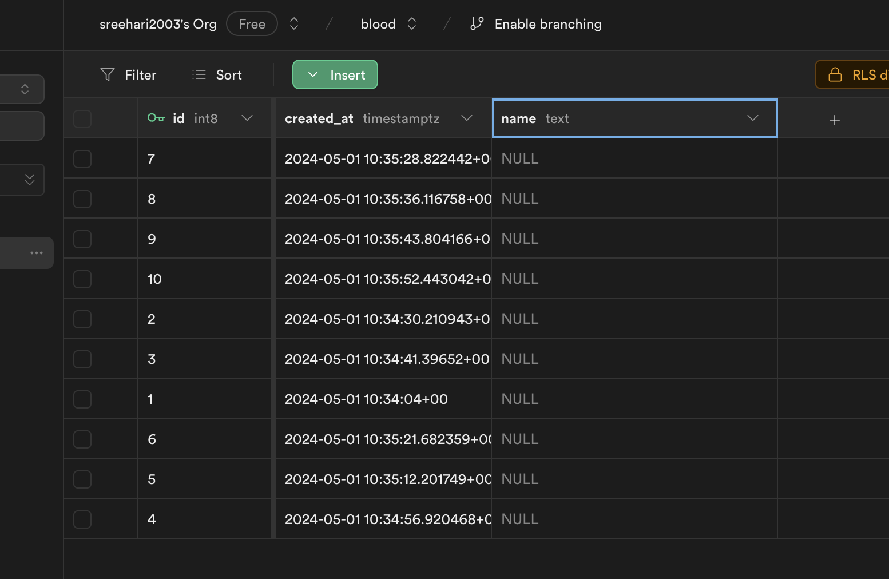
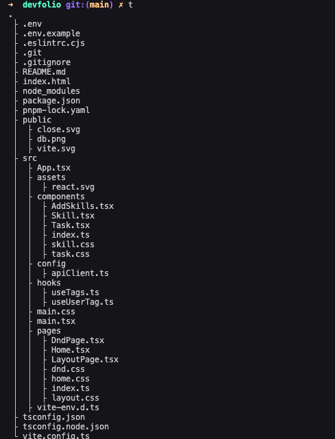

# Internship Task - Devfolio

- How to run the code 
```bash
pnpm install

pnpm run dev
```


## Challenge one 
<ul>
  <li>Added DND support</li>
  <li>Added supabase support to save tags</li>
  <li>Added react select to add new tags</li>
</ul> 


## Challenge two 
<ul>
  <li>Added Css Properly</li>
</ul> 


## Tech Used
- React js
- Typescript
- Css
- Supabase


### Code Quality 

- I have made sure to use all api call as hook
- Reduced number of useEffect hook
- Stored all 10 tags in supabase ui with tagName as null



### Things that can be improved
- Animation in dnd reordering
- Css Margin flickering when hover


### More Info
- I have used chatgpt , mdn docs and youtube to understand html dnd methods.
- For css I had to revisit how css postion properties works


## Folder structure

